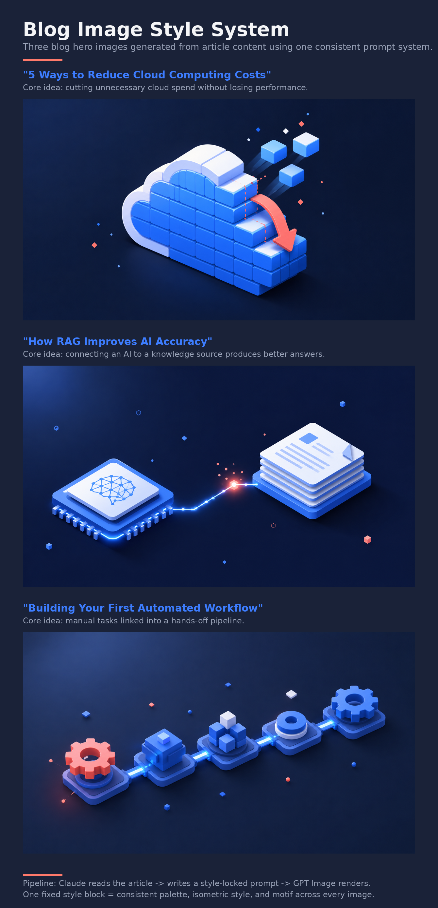

# Consistent Blog Image System

**Turning article content into on-brand blog images that stay visually consistent across an entire library — built so a non-technical team can run it.**

---

## The problem

Teams that publish regularly need blog images that match a consistent house style on *every* post — without a designer starting from scratch each time, and without the look drifting across hundreds of images.

## How it works

1. **Claude reads the article** and identifies the single core concept.
2. It writes an **image prompt locked to a fixed style spec** — palette, composition, recurring motifs, and mood.
3. An **image engine renders** the final image.

Because the style rules stay constant and only the article changes, every output stays on-brand.

## Sample results

Three blog hero images generated from three different article topics — cloud cost optimization, RAG / AI accuracy, and workflow automation — using **one** prompt system. Notice how the palette, isometric style, and recurring motifs hold steady across all three:

## What a full engagement delivers

- A documented **style spec** reverse-engineered from your existing image library
- A tuned **prompt system** (a fixed style block + a per-article content block)
- A simple **team SOP** anyone on the team can follow
- An optional **API-automation path** for scale

## Tools

Claude (prompt engineering) · GPT Image for rendering

---

*This sample was built on a demonstration style to show the method end to end. For a real project, the style spec is rebuilt from your existing images so new visuals match your library. Full prompt templates and the filled style spec are delivered as part of the engagement.*
